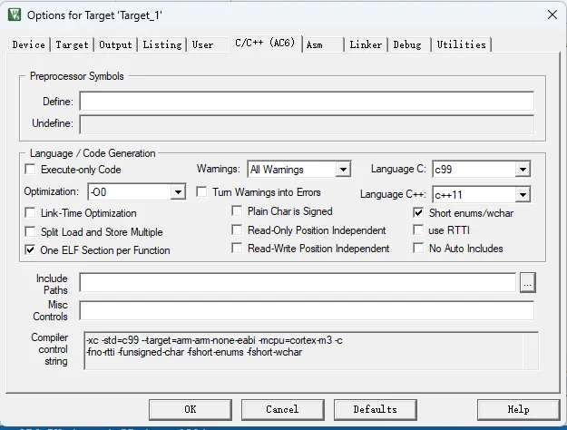
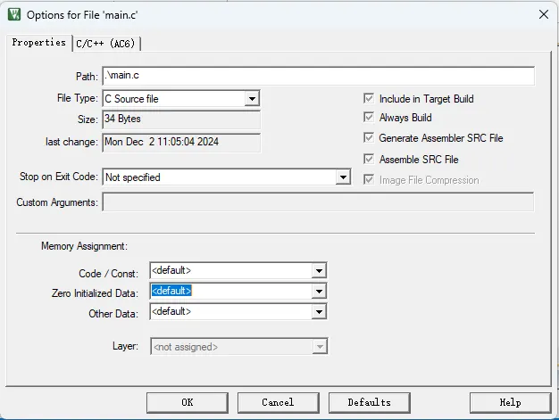
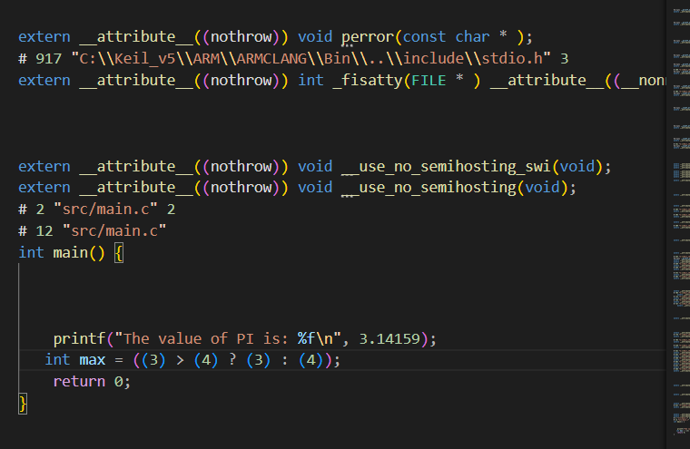

# 1工具链的编译
为了便于说明 ARM 编译套件的具体使用方法，以下创建两个源文件：hello.c 和 start.c，其源码如下所示：

hello.c:

c
int main(void) {
    for (;;) {
        // 无限循环
    }
    return 0;
}
start.c:

c
int main(void);

void start(void) {
    main();
}
注意：start() 函数调用了 main() 函数。在上述代码中，并未包含任何启动代码，如向量表、栈等设置。这里暂不关注这个问题。

编译链接
在编译代码时，编译器需要知道要以哪个架构为目标，以便利用特定于该架构的功能。其中：

arm-arm-none-eabi 表示为 AArch32 状态生成 A32 和 T32 指令

aarch64-arm-none-eabi 可用于生成 AArch64 指令

注意：必须与 -march（目标架构）或者 -mcpu（目标处理器）配合使用。

具体的处理过程
bash
## 编译 start.c 文件
armclang --target=arm-arm-none-eabi -mcpu=cortex-m3 -c .\start.c

## 编译 hello.c 文件
armclang --target=arm-arm-none-eabi -mcpu=cortex-m3 -c .\hello.c

## 链接目标文件
armlink start.o hello.o -o hello.axf
查看支持的架构和处理器
要查看所选目标支持的所有架构的列表，请使用：

bash
armclang --target=arm-arm-none-eabi -march=list
要查看所选目标支持的所有处理器的列表，请使用：

bash
armclang --target=arm-arm-none-eabi -mcpu=list
代码工作流程
上述代码工作流程如下：

将 start.c 编译为目标代码，并使用默认名称 start.o 保存

将 hello.c 编译为目标代码，并使用默认名称 hello.o 保存

链接目标文件 start.o 和 hello.o，生成名为 hello.axf 的可执行文件

经过上述处理，生成如下文件：

hello.axf - 可执行文件

hello.o、start.o - 目标文件

查看反汇编并转换成 bin 文件
查看反汇编
如果希望查看反汇编，可以使用 fromelf 命令来对 axf 文件进行处理：

bash
fromelf --text -c hello.axf
生成 bin 文件
如果希望生成 bin 文件，则命令如下：

bash
fromelf --bin --output=hello.bin hello.axf
注意事项
确保已正确安装 ARM 编译工具链

根据目标硬件选择合适的 -mcpu 参数

在实际项目中需要添加完整的启动代码（向量表、栈初始化等）

生成的 .axf 文件包含调试信息，适合调试使用

生成的 .bin 文件为纯二进制文件，适合烧录到目标设备

# 2.缺省配置
在Option for Target中，提供了对整个工程中所有文件的相关编译、链接配置选项。

当我们在Device中选择好相应的目标芯片时，Keil会自动给出缺省的配置。
其中，传递给armclang的参数，放在c/c++选项卡中的compiler control string中。用户在界面上进行的勾选，会影响到最终生成的参数列表，缺省的参数列表如下所示。

bash
-xc -std=c99 --target=arm-arm-none-eabi -mcpu=cortex-m3 -c
-fno-rtti -funsigned-char -fshort-enums -fshort-wchar
-D__EVAL -mlittle-endian -gdwarf-4 -O0 -ffunction-sections -Wall -Wextra -Wno-packed -Wno-reserved-id-macro -Wno-unused-macros -Wno-documentation-unknown-command -Wno-documentation -Wno-license-management -Wno-parentheses-equality -Wno-reserved-identifier
-I./RTE/_Target_1
-IC:/Users/lishutong/AppData/Local/Arm/Packs/ARM/CMSIS/6.1.0/CMSIS/Core/Include
-IC:/Users/lishutong/AppData/Local/Arm/Packs/ARM/Cortex_DFP/1.1.0/Device/ARMCM3/Include
-D__UVISION_VERSION="541" -DARMCM3 -D_RTE_
-o ./Objects/*.o -MMD

Asm中的参数列表由用于对汇编文件进行处理时使用，缺省的参数列表如下所示。

bash
--target=arm-arm-none-eabi -mcpu=cortex-m3 -masm=auto  -Wa,armasm,--diag_suppress=A1950W -c
-mlittle-endian -gdwarf-4 -Wa,armasm,--pd,"__EVAL SETA 1"
-I./RTE/_Target_1
-IC:/Users/lishutong/AppData/Local/Arm/Packs/ARM/CMSIS/6.1.0/CMSIS/Core/Include
-IC:/Users/lishutong/AppData/Local/Arm/Packs/ARM/Cortex_DFP/1.1.0/Device/ARMCM3/Include
-Wa,armasm,--pd,"__UVISION_VERSION SETA 541" -Wa,armasm,--pd,"ARMCM3 SETA 1" -Wa,armasm,--pd,"_RTE_ SETA 1"
-o ./Objects/*.o

Linker中的参数列表用于给armlink使用，用于链接器相关的配置，缺省的参数列表如下所示。

bash
--cpu Cortex-M3 *.o
--strict --scatter ".\RTE\Device\ARMCM3\ARMCM3_ac6.sct"
--summary_stderr --info summarysizes --map --load_addr_map_info --xref --callgraph --symbols
--info sizes --info totals --info unused --info veneers
--list ".\Listings\hello.map"
-o .\Objects\hello.axf

## 指定配置
如果想针对某个特定的源文件，设置其编译链接选项，则可以进入该源文件中的Option for file配置界面。然后，进行配置即可。

# 3.深入了解背后工作过程
本小节更深入地介绍整个编译处理过程，从而让你有更深入地理解。具体来说，完整的流程包含以下几个步骤：

## 预处理
预处理由预处理器（由armclang完成）执行。预处理器根据源代码中的预处理指令对代码进行修改，生成一个经过处理的源代码文件，供编译器进一步编译。例如，对于以下代码，预处理器主要完成以下几项工作：

main.c:

c
#include <stdio.h>
#define PI 3.14159
#define MAX(a, b) ((a) > (b) ? (a) : (b))

// test
#define VERSION 1.0

#ifndef VERSION
#error "VERSION is not defined!"
#endif

int main() {
    #ifdef DEBUG
        printf("Debug mode is on.\n");
    #endif
    printf("The value of PI is: %f\n", PI);
	  int max = MAX(3, 4);
    return 0;
}

宏定义展开如下图所示

