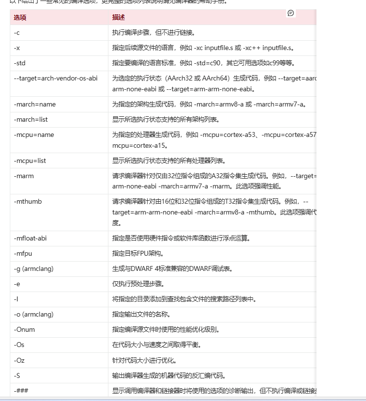
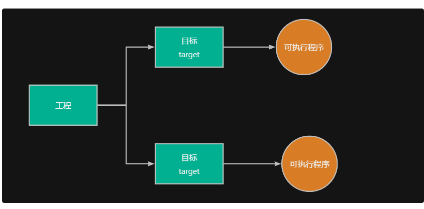
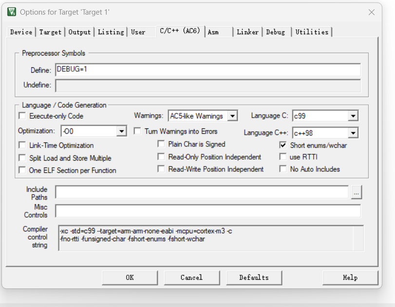
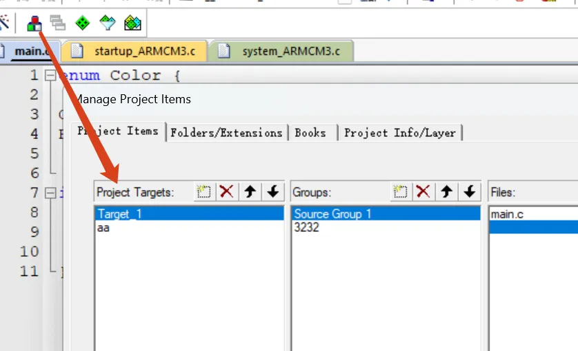
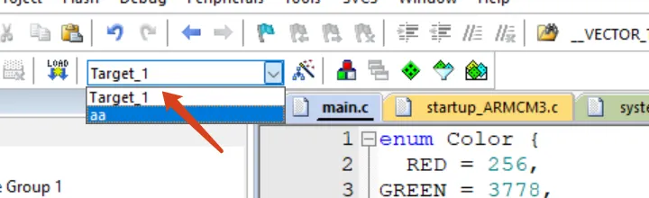

# 1.编译器选项
以下给出了一些常见的编译选项，更完整的选项列表说明请见编译器的帮助手册

# 2.向编译器传递宏定义
看到别人用cmake或make来管理工程，只需要用make+不同的目标名，就可以生成不同版本的代码，工程文件不需要任何改动。其实，这种可以通过一定的工程配置来实现，其中就需要用到-D选项。

-D选项用于通过选项告诉编译器定义的宏，其具体用法如下所示
bash
-D<name>[(<parm-list>)][=<def>]
上述各项中：
● parm：宏的名称。
● parm-list：（可选）：如果宏是带参数的宏，可以在这里指定参数列表。
● =<def>（可选）：宏的定义值。如果省略，则默认定义为 1。
下面举了一些例子。
bash
-DDEBUG    相当于 #define DEBUG 1
-DVERSION="1.2.3"   相当于#define VERSION "1.2.3"
-DMAX(a,b)=((a)>(b)?(a):(b)) 相当于#define MAX(a, b) ((a) > (b) ? (a) : (b))

# 3.工程配置
为了实现同一工程或源码包能够构建生成不同的可执行程序。通常情况下，我们用目标（target）这一概念来描述要生成的结果。下面给出了Keil和Make中创建不同目标的方法。

在创建完成之后，可以对每种工程目标设置编译、链接参数。例如，可以通过给目标设置不同的宏（-D），然后在源码中使用这些宏，从而构建生成不同的结果。

# 4.使用make构建
makefile
Make或CMake等工具使用配置文件来描述工程构建的行为。
# 定义 armclang 编译器
CC = armclang

# 定义通用的编译选项
CFLAGS = -Wall -O2

# 定义不同目标的 -D 选项
XXX_DEFINES = -DXXX
YYY_DEFINES = -DYYY

# 定义源文件和目标文件
SRC = main.c
OBJ = main.o

# 目标 xxx
xxx: $(OBJ_XXX)
    $(CC) $(CFLAGS) $(XXX_DEFINES) -o xxx $(OBJ)

$(OBJ_XXX): $(SRC)
    $(CC) $(CFLAGS) $(XXX_DEFINES) -c $< -o $@

# 目标 yyy
yyy: $(OBJ_YYY)
    $(CC) $(CFLAGS) $(YYY_DEFINES) -o yyy $(OBJ)

$(OBJ_YYY): $(SRC)
    $(CC) $(CFLAGS) $(YYY_DEFINES) -c $< -o $@

# 清理规则
clean:
    rm -f $(OBJ) xxx yyy    

同时，我们可在源码中，使用#if defined(XXX)等条件编译语句，从而控制构建生成不同的可执行程序。
