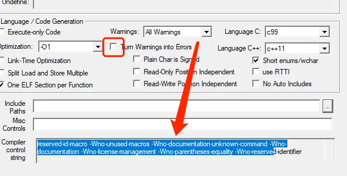

# 1. 读懂警告日志信息

在对工程进行构建时，armclang会打印很多信息，如警告和错误信息。

armclang 生成的消息格式如下：
```
<file>:<line>:<col>: <type>: <message>
```

- **file**：包含错误或警告的文件名
- **line**：包含错误或警告的行号  
- **col**：生成消息的列号（不一定存在）
- **type**：消息的类型，例如错误（error）或警告（warning）
- **消息文本**：该文本可能以诊断标志结束，标志形式为 `-W<flag>`，例如 `-Wvla-extension`，用于标识错误或警告。只有可以抑制的消息才有相关标志，不能抑制的错误没有相关标志

## 示例警告信息
```bash
file.c:8:7: warning: variable length arrays are a C99 feature [-Wvla-extension]
int i[n];
      ^
```

上述警告信息提示我们：
- 产生问题的文件是 `file.c`
- 问题出现在 `file.c` 的第 8 行，从第 7 个字符开始
- 警告内容是关于使用变量长度数组 `i[n]`
- 用于标识、启用或禁用此诊断消息的标志是 `-Wvla-extension`

# 警告配置

在某些情况下，可能需要对某些问题进行不同的处理，如将某种问题视为警告或视为错误。这种配置可通过如下选项进行配置：

| 配置选项 | 作用描述 |
|---------|----------|
| `-W<flag>` | 启用特定的警告 |
| `-Wno-<flag>` | 禁用特定的警告 |
| `-w` | 禁用所有警告 |
| `-Werror=<flag>` | 将特定的警告视为错误 |

其中，`flag` 表示某种特定的警告。armclang支持很多种类型的警告，这些警告有些默认是开启的、有些是关闭的。通过 `-W<flag>` 和 `-Wno-<flag>`，可以将指定的警告进行启用或禁止。

## 配置示例

**要禁用所有警告，请使用 `-w`：**
```bash
armclang --target=aarch64-arm-none-eabi -march=armv8-a -c file.c -w
```

**要仅禁用 `-Wformat` 警告，请使用 `-Wno-format`：**
```bash
armclang --target=aarch64-arm-none-eabi -march=armv8-a -c file.c -Wno-format
```

**要将 `-Wformat` 消息作为错误启用，请使用 `-Werror=format`：**
```bash
armclang --target=aarch64-arm-none-eabi -march=armv8-a -c file.c -Werror=format
```

在 Keil 中，提供了相关的配置界面，可以对警告做部分设置。如果想添加更多警告设置，可以自行添加编译参数处理。

