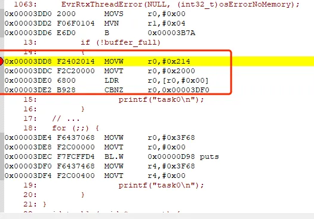

# 1.开优化后会影响程序调试的原因
'''c
int main() {
 int x=10, y=20;
 int z;
 z=x+y;
 return 0;
}
'''
如果不开启优化，则分析其反汇编可知：每一条C语言，都编译生成了若干条机器指令。因此，可以在每条语句上进行调试。

而一旦开启优化（如-O1)，则上面的无用代码z=x+y等就会被优化掉，最终就变成了只有return 0语句对应的机器指令。这样就造成了第2-4行无法调试。

不仅对于函数中的语句行，对于某些未用的变量、未被调用的函数等，也可能会被优化掉。
由此可见，一旦开启优化之后，由于没有相应的机器码与z=x+y等源码对应，自然也就无法对这些源码进行调试。
此外，对于一些函数内部的局部变量，当开启优化之后，编译器并不会在栈中为其分配空间用于存储其值。此时，我们将无法在观察窗口中看到局部变量的值

# 2.不同的优化等级的作用
在选择编译的优先等级时，需要注意的是：性能和体积不可兼得。如果使用更高的性能优化级别，则会调试体验降低、代码大小增加。如果减少代码大小，则会造成性能降低。具体而言，这些优化等级如下表格所示


上述表格可进一步简化为如下表格。


# 3.使用volatile避免过度优化

## 共享全局变量的问题
下面给出一个RTOS中多任务共享全局变量的示例。两个任务共同访问buffer_full变量
```c
int buffer_full;

void task0 (void *argument) {
	int count = 0;
	while (!buffer_full)
	{
			count++;
	}
  // ...
  for (;;) {
		printf("task0\n");
	}
}
void task1 (void *argument) {
	osDelay(1000);
	buffer_full = 1;
	
  // ...
  for (;;) {
		printf("task1\n");
	}
}
```
<span style="color:red">注：这里虽然使用多任务的场合来介绍；但是，同样也适用于中断与主程序之间共享全局变量的问题。


在不开启优化-O0的情况下，task0在每次循环中都从内存中读取buffer_full的值，然后再进行判断


而一旦开启优化-O1，则优化器知道当前函数中没有对buffer_full进行任何修改；因此，只读取一次进行判断，之后就进入到死循环中，与我们原本的预期行为不同。
而一旦加上volatile，则相当于知道优化器，buffer会在函数外部变化；因此，就会在循环中再次读取，从而每次都获得准确的值。


## 通过指针间接访问
如果在程序中通过指针间接访问全局变量，即便对变量加了volatile，也会出现问题。代码如下：
```c
volatile int buffer_full;

int * pbuffer = &buffer_full;

void task0 (void *argument) {
	int count = 0;
	while (!*pbuffer)
	{
			count++;
	}
  // ...
  for (;;) {
		printf("task0\n");
	}
}
void task1 (void *argument) {
	osDelay(1000);
	buffer_full = 1;
	
  // ...
  for (;;) {
		printf("task1\n");
	}
}
```

反汇编代码如下图所示。首先，通过指针读取全局变量的值，之后进入死循环中。由此可见，对于通过指针间接访问的全局变量，对变量加volatile没有效果。

正确的做法，对指针变量加上volatile，代码如下
```c
int buffer_full;

volatile int * pbuffer = &buffer_full;
```

<span style="color:red">这样修改后，反汇编代码如下。第一部分为读取到buffer_full的地址，第二部分为读取buffer_full的值并判断。第二部分中为一个循环，会反复地读取buffer_full的值并判断处理。这样程序的运行就正常了,如果两个都加没有区别

## 3.寄存器访问问题
在某些情况下，对于变量的访问，编译器可能会临时缓存到寄存器中。例如，对于如下代码：
```c
int buffer_full;

void task0 (void) {
	int count = 0;
	while (!buffer_full)
	{
			count++;
	}
}
void SysTick_Handler (void)  {
	buffer_full = 1;
}
 
void main (void) {
	task0();
}
```

生成的反汇编代码如下所示。可知，在task0中，仅在最开始读取了buffer_full的值到R0寄存器中。之后的循环判断中，不断地拿R0中的值进行判断，而不进行读取存储读取。这就导致即便SysTick_Handler的值发生了变化，task0也无法知道。


优化配置


## 4.访问寄存器
对于寄存器外设的访问，也应该使用volatile；因为该寄存器值可能随时被硬件修改。此时，即便程序没有开启任何编译优化，也应当加上volatile。例如：
```c
typedef struct
{
  __IOM uint32_t CTRL;                   /*!< Offset: 0x000 (R/W)  SysTick Control and Status Register */
  __IOM uint32_t LOAD;                   /*!< Offset: 0x004 (R/W)  SysTick Reload Value Register */
  __IOM uint32_t VAL;                    /*!< Offset: 0x008 (R/W)  SysTick Current Value Register */
  __IM  uint32_t CALIB;                  /*!< Offset: 0x00C (R/ )  SysTick Calibration Register */
} SysTick_Type;

#define     __O     volatile             /*!< Defines 'write only' permissions */
#define     __IO    volatile             /*!< Defines 'read / write' permissions */

/* following defines should be used for structure members */
#define     __IM     volatile const      /*! Defines 'read only' structure member permissions */
#define     __OM     volatile            /*! Defines 'write only' structure member permissions */
#define     __IOM    volatile            /*! Defines 'read / write' structure member permissions */
```

<span style=color:blue>以及另一种比较简单的写法
```c
#define SYSTICK_CTRL		*(volatile uint32_t *)0xF0000000
```

## 5.局部变量中的volatile
对于局部变量，也可以声明为volatile，以避免优化可能导致实现定时延迟的代码被移除。  例如，对于下述代码，如果不加volatile，则delay()函数会被直接优化掉。编译器并不知道该函数用于做循环，它会认为该函数没什么用处，所以就优化掉。
而一旦加上volatile，则编译器会假定time变量会在别的地方被优化；因此，会对delay()生成相应的指令，使得delay()不被优化掉。
```c
void delay (void) {
	volatile int time = 10000;
	while (time--) {}
}

void task0 (void *argument) {
 delay();
	int count = 0;
	while (!*pbuffer)
	{
			count++;
	}
  // ...
  for (;;) {
		printf("task0\n");
	}
}
```

### 注意事项
问题主要发生在循环访问共享变量的条件下。而如果在任务中，不存在循环；那么，开启优化之后，是否会有不恰当的副作用？

从反汇编代码可以看出，程序中存在读取buffer_full的行为，不影响程序的运行。因此，在这种非循环的情况下，加与不加volatile，对程序运行没有影响。