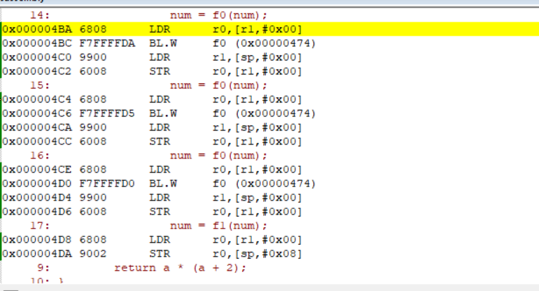

# 使用内联函数提升运行速度

## 什么是内联函数
内联函数是一种优化方法，目的是减少函数调用的开销。其工作原理为：将函数的代码直接嵌入到调用点，从而避免普通函数调用所需的栈操作和跳转指令，从而提高程序的运行效率。
内联函数通常用于频繁调用的小型函数，因为它们可以显著减少函数调用的开销。然而，过多使用内联可能会增加代码体积（代码膨胀），进而影响性能。
例如，对于下面的代码，假设循环中要求快速地读取寄存器变量reg。如果不采用内联；则每次循环时，都会进行一次函数调用。

```c
int read_reg (int reg) {
    return reg + 1;
}

int main() {
	  int reg = 0;
    while (read_reg(reg) < 0) {}
}
```


```c
int f0(int a)
{
	return a * (a + 1);
}

__attribute__ ((always_inline)) int f1(int a)
{
	return a * (a + 2);
}
int num = 0;
int main (void) {      
		num = f0(num);
		num = f0(num);
		num = f0(num);
		num = f0(num);
		num = f1(num);
		num = f1(num);
	  num = f1(num);
		num = f1(num);
		for(;;){}
}
```

