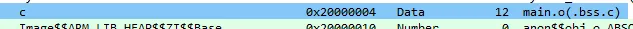
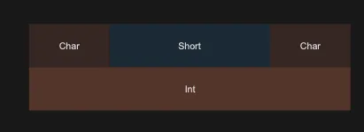
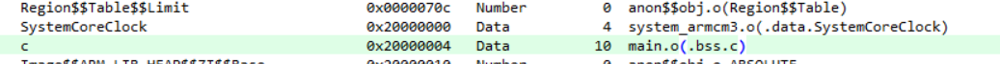
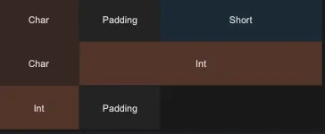

# 优化结构体占用的存储空间

在某些情况下，可以对结构体中的数据排列进行调整，从而进一步节省程序中所需的存储量

## 优化结构体占用的存储空间
如果结构体中的各个数据成员未打包，编译器可能会根据每个成员的自然对齐要求在结构体中添加填充，以加快访问速度。例如，对于以下代码：
```c
struct stc {
    char one;
    short two;
    char three;
    int four;
} c,d;


int main (void) {
    c.one=1;
    return 0;
}
```
在Corttex-M上，结构体stc占有的内存空间大小为12字节



内存排列排序如下图所示。通过这种方式，访问two和four成员时，由于地址已经分别对齐到2字节和4字节，可以直接使用ldrh和ldr指令进行取出。


但是，这样会导致额外浪费掉了4字节的空间。在对于存储敏感的场合，需要想办法将这段空间利用利用

## 使用pack指令
编译器提供了#pragma指令和attribute 属性，用于打包结构体或联合体的成员。打包之后，将取出中间的padding。例如，对于st结构，其成员的存储排列如下所示，整个结构所占用的存储空间将减少4字节，即只占用8字节。



● 为了实现这种打包，可以通过两种方法来实现：
#pragma pack (<n>) 如果<n>字节小于成员的自然对齐值，则将成员对齐到<n>字节；否则，成员的对齐值为其自然对齐值。
● __attribute((packed))__：等效于 #pragma pack(1)，但该属性也可用于结构体或联合体的单个成员。

## 打包整个结构体
对于整个结构体，可以使用__attribute__((packed))进行声明。之后，该结构体实体化生成的所有变量都进行了打包。
```c
struct __attribute__((packed)) stc {
    char one;
    short two;
    char three;
    int four;
} c,d;
```

而如果想能更简单地对多个结构进行设置，可以使用#pragma pack (1)，这样其后的所有结构都进行了打包。如果想恢复原有的对齐方式，则可以使用#pragma pack ()

```c
#pragma pack (1)
struct stc
{
    char one;
    short two;
    char three;
    int four;
} c,d;
struct stc1
{
    char one;
    short two;
    char three;
    int four;
} e,f;
#pragma pack ()   -- 恢复原有的对齐方式 
```

## 单个成员打包
对于结构体中的打个成员，也可以设置其对齐方式，从而减少结构体整体所需的内存量。不过这种设置不会影响其他成员的对齐。例如，可以指定four成员使用packed。
```c
struct stc
{
    char one;
    short two;
    char three;
    int  __attribute__((packed)) four;
} c,d;


int main (void)
{
    c.one=1;
    return 0;
}
```
修改之后，其成员存储排列如下所示






## 非对齐访问时可能出现异常
一旦结构体或联合体的成员是打包的，由于其不符合自然对齐要求；因此，在访问该成员时，必须使用包含该成员的结构体或联合体，而不得直接获取打包成员的地址并用作指针。例如，对于如下代码：

```c
struct __attribute__((packed)) bar {
  char x;
  short y;
};

short get_y(struct bar *s) {
    return s->y;
}

short get2_y(struct bar *s)
{
    short *p = &s->y; 
    return *p;  
}
```

如果处理器不支持地址不对齐的内存访问，则get2_y()执行过程中可能产生异常。例如，当p地址是0x20000001时，由于CPU指令不支持对非2字节地址对齐的位置进行读取，则触发CPU执行异常。
而get_y()不会产生这种问题，编译器会自动生成相应的指令，将y的值读取出来。


### 解释
<span style="color:red">&s->y 获取的是可能非对齐的地址</span>

<span style="color:red">将这个地址赋给 short* 指针，暗示这是一个合法的对齐地址</span>

<span style="color:red">解引用 *p 时，编译器假设地址是对齐的，可能生成单条加载指令：</span>


## 不使用打包来进一步减少内存
在某些情况下，可以通过调整结构体或联合体中的成员排列，使得编译器生成占用内存更小的类型。例如，我们可以将stc结构成员顺序进行调整，调整方法如下：

```c
struct stc {
    char one;
    char three;
    short two;
    int four;
} c,d;
```
在这种方式下，stc同样占用8字节，与使用__attribute__((packed))效果类似。
