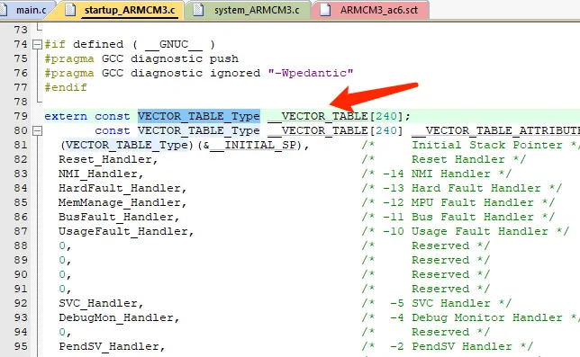

# 使用__attribute__配置函数和变量
armclang支持为函数、变量及类型设置某种特定的属性，从而扩展语言的功能。具体来说，可以通过如下方式设置一个或§§多个属性。
```c
__attribute__((attribute1, attribute2, ...))
__attribute__((__attribute1__, __attribute2__, ...))
```

## 1.__attribute__((used)指示已经使用
在某些情况下，如果函数或变量未被使用，则有可能在链接阶段被链接器给优化掉，从而减少存储空间的占用。
例如，对于下面的代码，f0()和num由于未被使用，将会被优化掉。

```c
int f0(int a)
{
    a=a*(a+1);
    return a;
}

int num = 0;

int main() {
    for (;;) {}
}
```

然而，有时候，我们希望避免这种优化。此时，可以使用__attribute__((used)指示某个函数或变量在某些地方被使用，不要将其从生成的可执行文件中去掉。
例如，对于用于Cortex-M的工程而言，必须包含一个向量表。而该向量表在定义之后，并不需要在其它地方使用，而是由硬件自行使用。如果不加以限制；那么，在链接过程中，该向量表将被优化掉。


因此，需要对该向量表添加used属性，通知编译器静态函数将保留在目标文件中，
```c
#ifndef __VECTOR_TABLE_ATTRIBUTE
#define __VECTOR_TABLE_ATTRIBUTE  __attribute__((used, section("RESET")))
#endif
```

## 2.__attribute__((aligned))指示对齐
在某些情况，可能需要指定变量、结构体成员、或类型的对齐方式。例如：
● 提高性能：某些硬件架构要求数据按照特定边界对齐（例如 8 字节或 16 字节）。不对齐的数据可能导致性能损失，或者在某些体系结构上，访问未对齐的数据可能会导致错误。
● 内存优化：当与 DMA 或硬件交互时，使用对齐属性可以确保数据在内存中的布局符合硬件要求。
通过__attribute__((aligned))，可以强制编译器将变量或类型按照指定的字节对齐（<value>）进行存储。例如

```c
struct MyStruct {
    char a;
    int __attribute__((aligned(8))) b; // 8字节对齐
};

struct MyStruct a;

int main (void) {	
    a.b = 3;
    return 0;
}
```

## 3.__attribute__((naked)
在某些情况下，我们可能希望完全用汇编重写某个C函数。此时，可以用对该函数使用__attribute__((naked)；之后，使用 __asm 语句完全用汇编代码编写函数体。
例如，我们可以编写如下代码：
```c
__attribute__((naked)) int add(int i, int j); 
__attribute__((naked)) int add(int i, int j)
{ 
  __asm("ADD r0, r1, #1"); 
}

```