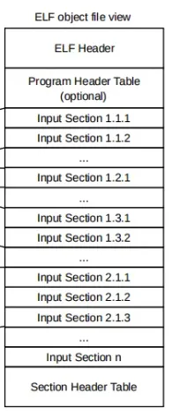
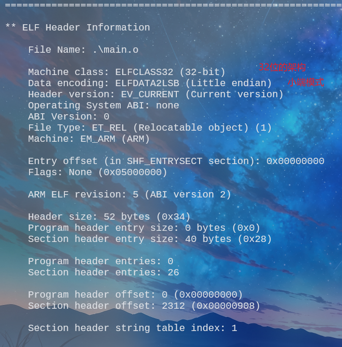

## 目标文件格式
如下图所求，为编译生成的目标文件的ELF文件格式（该图从ARM编译器参考手册中获取）


从上图可以看出，该格式主要包含三大块：
● ELF 文件头（ELF Header）：位于文件的开头，描述文件的基本信息，如目标架构、入口点、段头表和节头表的位置。
● 程序头表（Program Header Table）（可选）：描述编译生成的各种段（Segment），如代码段、数据段等，用于加载到内存。
● 输入段（Input Sections）输入段是目标文件的核心部分，包含代码、数据或其他信息。每个输入段可以具有不同的属性（如只读、读写、执行等）。输入段通常按功能或类型分组，例如：
    ■ 代码段（如.text）：包含可执行代码（机器码）。
    ■ 数据段（如.data）：包含已初始化的全局变量和局部静态变量。
    ■ 未初始化段（如.bss）：描述未初始化或需要置零的内存区域（全局或局部静态变量）。
    ■ 常量数据段（.rodata）：包含一些常量数据等。
● 段头表（Section Header Table）：描述文件的段（Section），包括每个段的名称、类型、大小、偏移和属性。即该表提供了对输入段的详细描述，链接器使用它来定位和处理各个节。也就是说，可以通过该表，找到各个input section的位置。
其中，编译器在编译时，输入段可以按功能或类型分组，例如：
  ○ 组 1：包含多个输入段（如 1.1.1、1.1.2 等）。
  ○ 组 2：包含其他输入段（如 2.1.1、2.1.2 等）。
以上这些输入段最终会被链接器合并为输出段（Output Sections），并分配到内存中的特定区域。

## 实例
下面是一个小的例子，可用于分析代码中的各元素在实际生成的结果中对应的是什么。
```c

// 已初始化的全局变量 -> 存储在 .data 段
int initialized_global_var __attribute__((used)) = 10;

// 未初始化的全局变量 -> 存储在 .bss 段
volatile int uninitialized_global_var __attribute__((used));

// 函数 -> 代码存储在 .text 段
void foo() {
    // 局部变量 -> 存储在栈中，不会出现在目标文件的段中
    int local_var = 30;
}

char * ss __attribute__((used)) = "Hello";

int main() {
    // 未初始化的局部静态变量 -> 存储在 .bss 段
    static int uninitialized_static_local_var __attribute__((used));

    // 已初始化的局部静态变量 -> 存储在 .data 段
    static int initialized_static_local_var  __attribute__((used))= 40;

    // 调用函数
    foo();
    for (;;) {uninitialized_global_var++;}
    return 0;
}
```



对编译生成的目标文件进行解析：fromelf  .\main.o。可得到结果如下：
```c
** ELF Header Information

    File Name: .\main.o

    Machine class: ELFCLASS32 (32-bit)
    Data encoding: ELFDATA2LSB (Little endian)
    Header version: EV_CURRENT (Current version)
    Operating System ABI: none
    ABI Version: 0
    File Type: ET_REL (Relocatable object) (1)
    Machine: EM_ARM (ARM)

    Entry offset (in SHF_ENTRYSECT section): 0x00000000
    Flags: None (0x05000000)

    ARM ELF revision: 5 (ABI version 2)

    Header size: 52 bytes (0x34)
    Program header entry size: 0 bytes (0x0)
    Section header entry size: 40 bytes (0x28)

    Program header entries: 0
    Section header entries: 32

    Program header offset: 0 (0x00000000)
    Section header offset: 2376 (0x00000948)

    Section header string table index: 1

========================================================================

** Section #1 '.strtab' (SHT_STRTAB)
    Size   : 525 bytes


** Section #2 '.text' (SHT_PROGBITS) [SHF_ALLOC + SHF_EXECINSTR]
    Size   : 0 bytes (alignment 4)
    Address: 0x00000000


** Section #3 '.text.foo' (SHT_PROGBITS) [SHF_ALLOC + SHF_EXECINSTR]
    Size   : 10 bytes (alignment 4)
    Address: 0x00000000


** Section #4 '.ARM.exidx.text.foo' (SHT_ARM_EXIDX) [SHF_ALLOC + SHF_LINK_ORDER]
    Size   : 8 bytes (alignment 4)
    Address: 0x00000000
    Link to section #3 '.text.foo'


** Section #5 '.rel.ARM.exidx.text.foo' (SHT_REL) [SHF_INFO_LINK]
    Size   : 8 bytes (alignment 4)
    Symbol table #31 '.symtab'
    1 relocations applied to section #4 '.ARM.exidx.text.foo'


** Section #6 '.text.main' (SHT_PROGBITS) [SHF_ALLOC + SHF_EXECINSTR]
    Size   : 16 bytes (alignment 4)
    Address: 0x00000000


** Section #7 '.rel.text.main' (SHT_REL) [SHF_INFO_LINK]
    Size   : 8 bytes (alignment 4)
    Symbol table #31 '.symtab'
    1 relocations applied to section #6 '.text.main'


** Section #8 '.ARM.exidx.text.main' (SHT_ARM_EXIDX) [SHF_ALLOC + SHF_LINK_ORDER]
    Size   : 8 bytes (alignment 4)
    Address: 0x00000000
    Link to section #6 '.text.main'


** Section #9 '.rel.ARM.exidx.text.main' (SHT_REL) [SHF_INFO_LINK]
    Size   : 8 bytes (alignment 4)
    Symbol table #31 '.symtab'
    1 relocations applied to section #8 '.ARM.exidx.text.main'


** Section #10 '.data.initialized_global_var' (SHT_PROGBITS) [SHF_ALLOC + SHF_WRITE + 0x00200000]
    Size   : 4 bytes (alignment 4)
    Address: 0x00000000


** Section #11 '.rodata.str1.1' (SHT_PROGBITS) [SHF_ALLOC + SHF_MERGE + SHF_STRINGS]
    Size   : 6 bytes
    Address: 0x00000000


** Section #12 '.data.ss' (SHT_PROGBITS) [SHF_ALLOC + SHF_WRITE + 0x00200000]
    Size   : 4 bytes (alignment 4)
    Address: 0x00000000


** Section #13 '.rel.data.ss' (SHT_REL) [SHF_INFO_LINK]
    Size   : 8 bytes (alignment 4)
    Symbol table #31 '.symtab'
    1 relocations applied to section #12 '.data.ss'


** Section #14 '.bss.main.uninitialized_static_local_var' (SHT_NOBITS) [SHF_ALLOC + SHF_WRITE + 0x00200000]
    Size   : 4 bytes (alignment 4)
    Address: 0x00000000


** Section #15 '.data.main.initialized_static_local_var' (SHT_PROGBITS) [SHF_ALLOC + SHF_WRITE + 0x00200000]
    Size   : 4 bytes (alignment 4)
    Address: 0x00000000


** Section #16 '.bss.uninitialized_global_var' (SHT_NOBITS) [SHF_ALLOC + SHF_WRITE + 0x00200000]
    Size   : 4 bytes (alignment 4)
    Address: 0x00000000


** Section #17 '.ARM.use_no_argv' (SHT_PROGBITS) [SHF_ALLOC + SHF_WRITE + 0x00200000]
    Size   : 4 bytes (alignment 4)
    Address: 0x00000000


** Section #18 '.debug_abbrev' (SHT_PROGBITS)
    Size   : 165 bytes


** Section #19 '.debug_info' (SHT_PROGBITS)
    Size   : 229 bytes


** Section #20 '.rel.debug_info' (SHT_REL) [SHF_INFO_LINK]
    Size   : 200 bytes (alignment 4)
    Symbol table #31 '.symtab'
    25 relocations applied to section #19 '.debug_info'


** Section #21 '.debug_ranges' (SHT_PROGBITS)
    Size   : 24 bytes


** Section #22 '.rel.debug_ranges' (SHT_REL) [SHF_INFO_LINK]
    Size   : 32 bytes (alignment 4)
    Symbol table #31 '.symtab'
    4 relocations applied to section #21 '.debug_ranges'


** Section #23 '.debug_str' (SHT_PROGBITS) [SHF_MERGE + SHF_STRINGS]
    Size   : 255 bytes


** Section #24 '.comment' (SHT_PROGBITS) [SHF_MERGE + SHF_STRINGS]
    Size   : 69 bytes


** Section #25 '.note.GNU-stack' (SHT_PROGBITS)
    Size   : 0 bytes


** Section #26 '.ARM.attributes' (SHT_ARM_ATTRIBUTES)
    Size   : 80 bytes


** Section #27 '.debug_frame' (SHT_PROGBITS)
    Size   : 68 bytes (alignment 4)


** Section #28 '.rel.debug_frame' (SHT_REL) [SHF_INFO_LINK]
    Size   : 32 bytes (alignment 4)
    Symbol table #31 '.symtab'
    4 relocations applied to section #27 '.debug_frame'


** Section #29 '.debug_line' (SHT_PROGBITS)
    Size   : 83 bytes


** Section #30 '.rel.debug_line' (SHT_REL) [SHF_INFO_LINK]
    Size   : 16 bytes (alignment 4)
    Symbol table #31 '.symtab'
    2 relocations applied to section #29 '.debug_line'


** Section #31 '.symtab' (SHT_SYMTAB)
    Size   : 432 bytes (alignment 4)
    String table #1 '.strtab'
    Last local symbol no. 20

```
从上述结果可以看出，编译器将各个函数、变量分别放在了不同的Section中。例如，main函数编译生成的机器码放在了.text.main中。