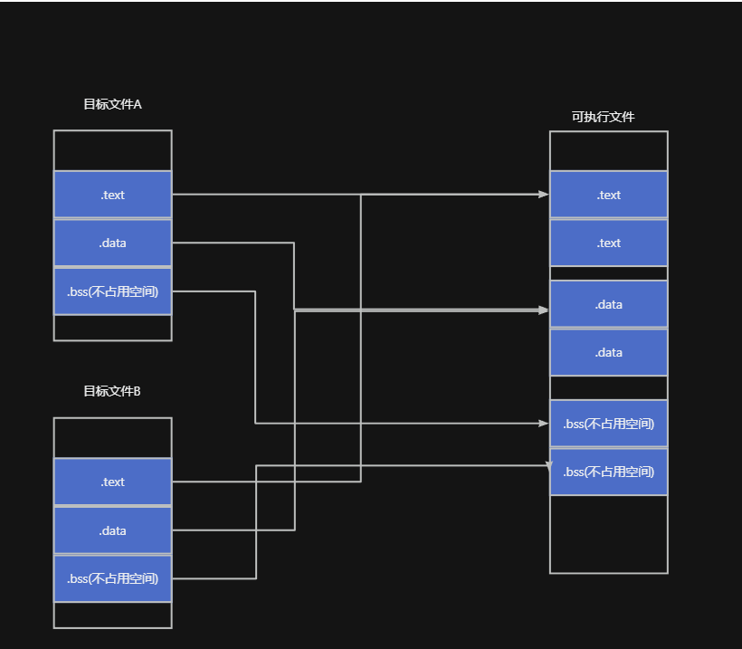
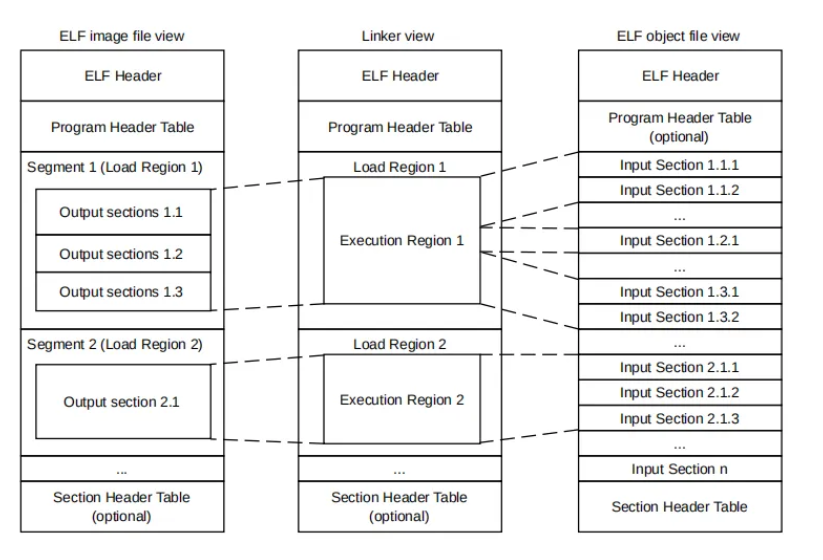
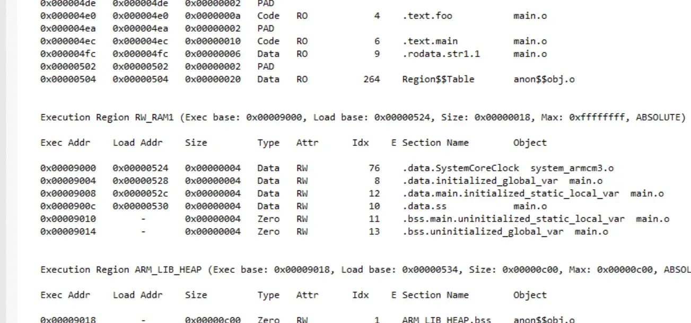

# 工程流程
在进行工程构建时，链接器会将编译生成的所有目标文件进行链接，生成可执行文件。无论是目标文件还是可执行文件，都是ELF格式。这个过程如下图所示：



在链接过程中，链接器会根据链接配置（如分散加载文件或其内置规则），将不同目标文件中相同属性的输入段进行合并，生成相同属性的输出段。例如，将不同目标文件中的RO输入段全合并生成一个RO输出段



在目标文件（上图右侧）中，包含了很多输入段（Input Section），这些段包含了目标文件中的.text、.data、.bss等代码和数据。而链接生成的可执行文件（上图左侧），包含了很多输出段（Output section），这些段中同包含了text、.data、.bss等代码和数据。
如果某些输出段可以连续存储（或根据分散加载文件中的配置），则在ELF文件中生成为一个节（Segment）。缺省情况下，在每个节中，依次存储.text、.data、.bss三种类型的输出段。

也就是说，链接器会将不同源文件编译后生成的代码、数据等按属性进行合并，并根据在内存中存放的地址，分开放置在不同的段中。例如，我们可以通过如下结果，来理解这一过程。

通过运行
```bash
fromelf -v .\hello.axf
```
得到如下结果
```c
** ELF Header Information

    File Name: .\hello.axf

    Machine class: ELFCLASS32 (32-bit)
    Data encoding: ELFDATA2LSB (Little endian)
    Header version: EV_CURRENT (Current version)
    Operating System ABI: none
    ABI Version: 0
    File Type: ET_EXEC (Executable) (2)
    Machine: EM_ARM (ARM)

    Image Entry point: 0x000003c1
    Flags: EF_ARM_HASENTRY + EF_ARM_ABI_FLOAT_SOFT (0x05000202)

    ARM ELF revision: 5 (ABI version 2)

    Conforms to Soft float procedure-call standard

    Built with
    Component: Arm Compiler for Embedded 6.22 Tool: armlink [5ee90200]

    Header size: 52 bytes (0x34)
    Program header entry size: 32 bytes (0x20)
    Section header entry size: 40 bytes (0x28)

    Program header entries: 1
    Section header entries: 17

    Program header offset: 13884 (0x0000363c)
    Section header offset: 13916 (0x0000365c)

    Section header string table index: 16

========================================================================

** Program header #0

    Type          : PT_LOAD (1)
    File Offset   : 52 (0x34)
    Virtual Addr  : 0x00000000
    Physical Addr : 0x00000000
    Size in file  : 1332 bytes (0x534)
    Size in memory: 4924 bytes (0x133c)
    Flags         : PF_X + PF_W + PF_R + PF_ARM_ENTRY (0x80000007)
    Alignment     : 4


========================================================================

** Section #1

    Name        : ER_ROM
    Type        : SHT_PROGBITS (0x00000001)
    Flags       : SHF_ALLOC + SHF_EXECINSTR (0x00000006)
    Addr        : 0x00000000
    File Offset : 52 (0x34)
    Size        : 1316 bytes (0x524)
    Link        : SHN_UNDEF
    Info        : 0
    Alignment   : 4
    Entry Size  : 0


====================================

** Section #2

    Name        : RW_RAM1
    Type        : SHT_PROGBITS (0x00000001)
    Flags       : SHF_ALLOC + SHF_WRITE (0x00000003)
    Addr        : 0x00009000
    File Offset : 1368 (0x558)
    Size        : 16 bytes (0x10)
    Link        : SHN_UNDEF
    Info        : 0
    Alignment   : 4
    Entry Size  : 0


====================================

** Section #3

    Name        : RW_RAM1
    Type        : SHT_NOBITS (0x00000008)
    Flags       : SHF_ALLOC + SHF_WRITE (0x00000003)
    Addr        : 0x00009010
    File Offset : 1384 (0x568)
    Size        : 8 bytes (0x8)
    Link        : SHN_UNDEF
    Info        : 0
    Alignment   : 4
    Entry Size  : 0


====================================

** Section #4

    Name        : ARM_LIB_HEAP
    Type        : SHT_NOBITS (0x00000008)
    Flags       : SHF_ALLOC + SHF_WRITE (0x00000003)
    Addr        : 0x00009018
    File Offset : 1384 (0x568)
    Size        : 3072 bytes (0xc00)
    Link        : SHN_UNDEF
    Info        : 0
    Alignment   : 1
    Entry Size  : 0


====================================

** Section #5

    Name        : ARM_LIB_STACK
    Type        : SHT_NOBITS (0x00000008)
    Flags       : SHF_ALLOC + SHF_WRITE (0x00000003)
    Addr        : 0x00047e00
    File Offset : 1384 (0x568)
    Size        : 512 bytes (0x200)
    Link        : SHN_UNDEF
    Info        : 0
    Alignment   : 1
    Entry Size  : 0


====================================

** Section #6

    Name        : .debug_abbrev
    Type        : SHT_PROGBITS (0x00000001)
    Flags       : None (0x00000000)
    Addr        : 0x00000000
    File Offset : 1384 (0x568)
    Size        : 492 bytes (0x1ec)
    Link        : SHN_UNDEF
    Info        : 0
    Alignment   : 1
    Entry Size  : 0


====================================

** Section #7

    Name        : .debug_frame
    Type        : SHT_PROGBITS (0x00000001)
    Flags       : None (0x00000000)
    Addr        : 0x00000000
    File Offset : 1876 (0x754)
    Size        : 600 bytes (0x258)
    Link        : SHN_UNDEF
    Info        : 0
    Alignment   : 1
    Entry Size  : 0


====================================

** Section #8

    Name        : .debug_info
    Type        : SHT_PROGBITS (0x00000001)
    Flags       : None (0x00000000)
    Addr        : 0x00000000
    File Offset : 2476 (0x9ac)
    Size        : 921 bytes (0x399)
    Link        : SHN_UNDEF
    Info        : 0
    Alignment   : 1
    Entry Size  : 0


====================================

** Section #9

    Name        : .debug_line
    Type        : SHT_PROGBITS (0x00000001)
    Flags       : None (0x00000000)
    Addr        : 0x00000000
    File Offset : 3397 (0xd45)
    Size        : 612 bytes (0x264)
    Link        : SHN_UNDEF
    Info        : 0
    Alignment   : 1
    Entry Size  : 0


====================================

** Section #10

    Name        : .debug_ranges
    Type        : SHT_PROGBITS (0x00000001)
    Flags       : None (0x00000000)
    Addr        : 0x00000000
    File Offset : 4009 (0xfa9)
    Size        : 80 bytes (0x50)
    Link        : SHN_UNDEF
    Info        : 0
    Alignment   : 1
    Entry Size  : 0


====================================

** Section #11

    Name        : .debug_str
    Type        : SHT_PROGBITS (0x00000001)
    Flags       : None (0x00000000)
    Addr        : 0x00000000
    File Offset : 4089 (0xff9)
    Size        : 860 bytes (0x35c)
    Link        : SHN_UNDEF
    Info        : 0
    Alignment   : 1
    Entry Size  : 0


====================================

** Section #12

    Name        : .symtab
    Type        : SHT_SYMTAB (0x00000002)
    Flags       : None (0x00000000)
    Addr        : 0x00000000
    File Offset : 4952 (0x1358)
    Size        : 3632 bytes (0xe30)
    Link        : Section 13 (.strtab)
    Info        : Last local symbol no = 135
    Alignment   : 4
    Entry Size  : 16


====================================

** Section #13

    Name        : .strtab
    Type        : SHT_STRTAB (0x00000003)
    Flags       : None (0x00000000)
    Addr        : 0x00000000
    File Offset : 8584 (0x2188)
    Size        : 4004 bytes (0xfa4)
    Link        : SHN_UNDEF
    Info        : 0
    Alignment   : 1
    Entry Size  : 0


====================================

** Section #14

    Name        : .note
    Type        : SHT_NOTE (0x00000007)
    Flags       : None (0x00000000)
    Addr        : 0x00000000
    File Offset : 12588 (0x312c)
    Size        : 36 bytes (0x24)
    Link        : SHN_UNDEF
    Info        : 0
    Alignment   : 4
    Entry Size  : 0

        Section     Segment
    ====================================

              1           0
              2           0
              3           0
              4           0
              5           0

====================================

** Section #15

    Name        : .comment
    Type        : SHT_PROGBITS (0x00000001)
    Flags       : None (0x00000000)
    Addr        : 0x00000000
    File Offset : 12624 (0x3150)
    Size        : 1100 bytes (0x44c)
    Link        : SHN_UNDEF
    Info        : 0
    Alignment   : 1
    Entry Size  : 0

    Component: Arm Compiler for Embedded 6.22 Tool: armlink [5ee90200]
    ArmLink --strict --callgraph --load_addr_map_info --map --symbols --cpu=Cortex-M3 --list=.\Listings\hello.map --output=.\Objects\hello.axf --scatter=.\RTE\Device\ARMCM3\ARMCM3_ac6.sct --info=summarysizes,sizes

    C:\Users\lishutong\AppData\Local\Keil_v5\ARM\ARMCLANG\Bin\..\lib\armlib\c_w.l
    C:\Users\lishutong\AppData\Local\Keil_v5\ARM\ARMCLANG\Bin\..\lib\armlib\fz_ws.l
    C:\Users\lishutong\AppData\Local\Keil_v5\ARM\ARMCLANG\Bin\..\lib\armlib\h_w.l
    C:\Users\lishutong\AppData\Local\Keil_v5\ARM\ARMCLANG\Bin\..\lib\libcxx\libcpp-experimental_w.l
    C:\Users\lishutong\AppData\Local\Keil_v5\ARM\ARMCLANG\Bin\..\lib\libcxx\libcpp_w.l
    C:\Users\lishutong\AppData\Local\Keil_v5\ARM\ARMCLANG\Bin\..\lib\libcxx\libcppabi_w.l
    C:\Users\lishutong\AppData\Local\Keil_v5\ARM\ARMCLANG\Bin\..\lib\armlib\m_ws.l
    C:\Users\lishutong\AppData\Local\Keil_v5\ARM\ARMCLANG\Bin\..\lib\armlib\vfpsupport.l
    Input Comments:

    main.o
    retarget_io.o
    stdout_itm.o
    startup_armcm3.o
    system_armcm3.o


    Component: Arm Compiler for Embedded 6.22 Tool: armclang [5ee92100]


====================================

** Section #16

    Name        : .shstrtab
    Type        : SHT_STRTAB (0x00000003)
    Flags       : None (0x00000000)
    Addr        : 0x00000000
    File Offset : 13724 (0x359c)
    Size        : 160 bytes (0xa0)
    Link        : SHN_UNDEF
    Info        : 0
    Alignment   : 1
    Entry Size  : 0


====================================
```
同时，可以借助Keil构建时自动生成的.map文件来辅助分析。
