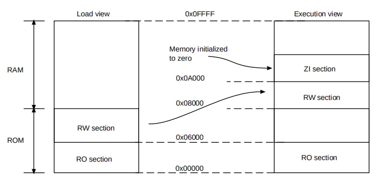
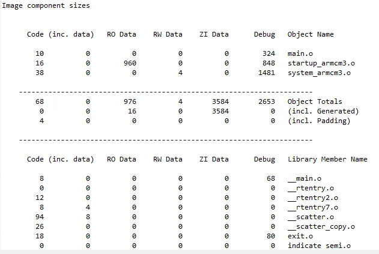

# 程序是如何加载运行的
在拿到构建生成的ELF文件之后，我们可以借助一些工具将其中的代码和数据烧写到芯片的Flash中(由下载器（Jlink）烧写到芯片的Flash存储中)。

烧写工具会自动扫描ELF文件中的节（加载域），从中了解其烧写的目标地址等信息，之后将程序写入到指定的位置。一旦烧写完成后，我们观察到的程序代码和数据的存储位置布局，叫做加载视图（Load View）。

但是，一旦程序运行起来，我们可能希望对数据进行搬运，或者对某些内存区域进行清0.完成这些工作之后，程序才正式å开始运行（如运行main()）函数。因此，这种程序运行时，代码和数据的存储位置布局，叫做执行视图（Execution view）。

例如，在下图的简单应用中，在程序正式运行前，需要在RAM中设置好全局变量（静态变量）的初始值。对于程序中已经给定了非0初始值的变量，需要将这些值从ROM中拷贝到RAM中（即拷贝RW段）；而对于初始值为0的变量，则只需要对其所在的内存区域进行清0（即清0 ZI段）



在某些情况下，如想让部分代码能够在RAM中执行，也需要做类似的搬运操作。
flash中.text.rodata不会动，，将.data放到RAM中
提示：RAM是易失性存储器，上电后其值是不确定的；因此，放在RAM中的全局变量必须进行初始化。这些初始化值只能保存在非易失性的存储器ROM中。

# 为什么会有.bss区域
.bss 段的存在是为了优化可执行文件的大小和加载效率，具体原因如下：
● 节省磁盘空间：由于全部值为0；因此，不需要在文件中占用存储空间，只需要记下哪个位置、有多大空间需要设置为0即可。
● 提高加载效率：在程序加载时，只需要清0相应的内存，而不需要将数据从Flash拷贝到内存，从而提高程序的启动效率。
例如，在下面的代码中，定义一个未初始化的全局数组
```c
int buffer[1000];
```
这个数组会被分配到 .bss 段。在目标文件中，只需记录数组的大小（4000字节），不需要在Flash中占用40000字节的空间。程序运行时，直接对内存进行清0即可

# 获取可执行文件的详细信息
果我们想知道生成的可执行文件的详细信息，可以通过armlink支持的某些选项来获取。
这个选项可以在链接过程中生成各种关于链接器行为、内存布局、符号信息等的详细报告。例如，使用Keil进行工程构建时，生成的.map文件内容就由其来控制。

## --info选项
--info=sizes用于显示输入目标文件和库文件的代码和数据大小信息。
```bash
armlink --info=sizes file.o --output=output.axf
```

生成的结果应当如下所示：



● Code (inc. data)：代码和内联数据占用的字节数。其中，inc. data为内联数据，用于存储文字池和短字符串。
● RO Data：只读数据的字节数，附加在代码内联数据的基础上。
● RW Data：RW数据的字节数。
● ZI Data：ZI数据的字节数。
● Debug：调试数据的大小。
● Object Name：当前所属的目标文件。
● Object Totals：所有输入文件生成的内容的字节数总和。
● incl. Generated：armlink可能会生成一些特殊的内容，如Interworking Veneers和Region Tables。这些区域表会占用一些额外的存储空间。
● incl. Padding：armlink为了确保section对齐，可能会额外插入一些存储空间。
这些由链接器生成的内容会被自动添加到最终的图像中，并占用额外的内存。
● Grand Totals：显示可执行文件的实际大小，包括ZI数据。
● ELF Image Totals：如果启用了RW数据压缩，显示经过压缩后的文件大小。
● ROM Totals：显示最小占用ROM的空间大小，即不包括ZI数据和调试信息的大小。
--info=unused：显示未使用的段信息。如果程序中有未使用的代码或数据段，链接器会输出相关警告