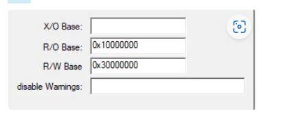
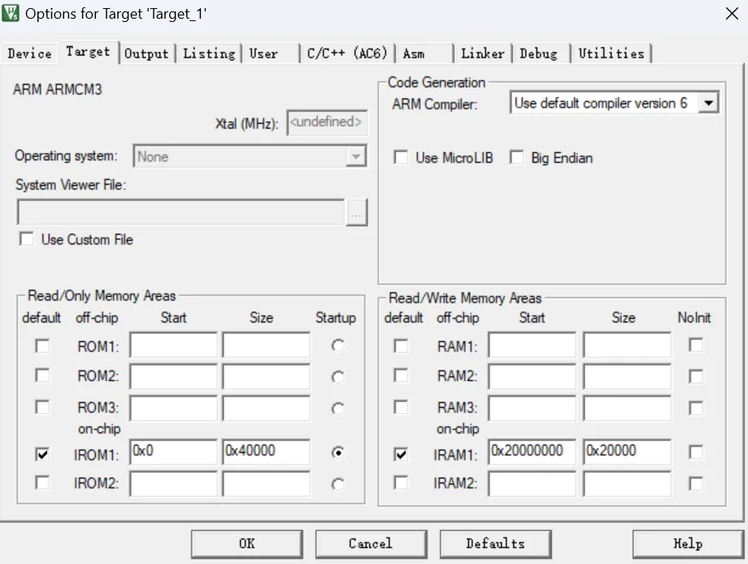
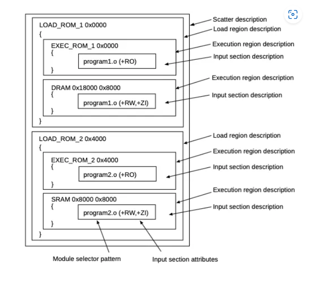
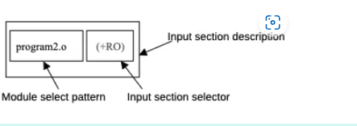
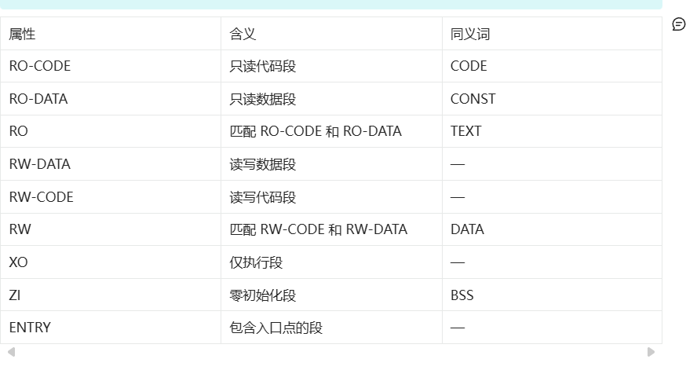
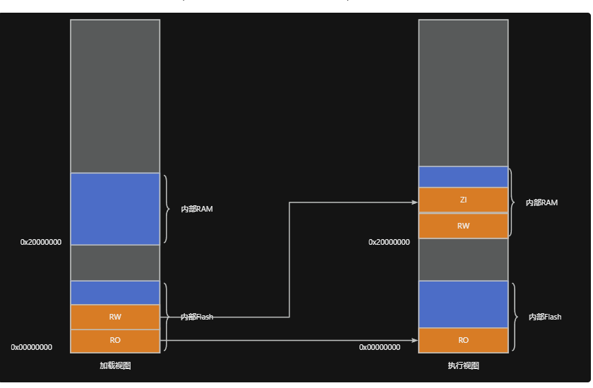

# 分散加载文件
armclang工具链仍然沿用了armcc的使用分散加载文件控制链接过程的做法。  当然，我们也可以不使用分散加载文件，而使用简单的命令行控制。以下将分别介绍这两种方式。

## 使用命令行控制
对于简单的映像，可以使用以下与内存映射相关的选项：  
● --ro_base=address 用于指定包含只读（RO）输出部分的加载和执行区域的地址。  
● --rw_base=address 用于指定包含读写（RW）输出部分的执行区域的地址。 
● --zi_base=address 用于指定包含零初始化（ZI）输出部分的执行区域的地址。
为什么这里rw_base不用于指定加载域的地址？
rw对应可读写的数据，我们主要关心其在RAM中的位置。至于它的值存储在哪里，链接器会根据ro_base的值自动进行设置，我们无需关心。
例如，我们可以通过命令行来指定RO、RW、ZI区的起始地址。

```bash
armlink --ro_base=0x0 --rw_base=0x30000000 --zi_base=0x40000000 init.o main.o
```
我们可以直接在Keil的工程属性Linker页面中进行配置（在不使用分散加载文件前提下。注意，无法配置ZI的加载域）



## 使用分散加载文件控制
而对于复杂的映像，或者我们可能想实现更为精细的控制，则可以使用分散加载描述文件（scatter file）。该文件主要用于描述程序代码和数据在存储器中的布局方式，可以实现更为复杂灵活的配置（类似于GCC中的ld链接脚本文件）。
此时，我们需要在命令行中通过 --scatter 选项指定采用的文件。一个典型的分散加载
文件示例如下：
```c
ROM_LOAD 0x00000000 0x40000   ; 加载区域定义
{
    ROM_EXEC 0x00000000 0x40000 ; 执行区域
    {
        *.o (RESET, +First)     ; 首先放置复位向量
        *(InRoot$$Sections)     ; 库需要的特殊段
        .ANY (+RO)             ; 所有只读代码和数据
    }
    
    RAM 0x10000000 0x8000      ; RAM区域
    {
        .ANY (+RW +ZI)         ; 读写数据和零初始化数据
    }
}
```

可以看到，这种方式与前面的命令行的参数选项，实现了相同的功能。但是，使用分散加载文件，可以做到更为灵活的控制。
或者，我们也可以在Target页面中进行配置。此时，Keil会自动在工程目录Object目录下生成一个分散加载文件。
-场景一:多块非连续存储,可以通过分散加载文件，让某个程序模块放到外部Flash
中的特定区域
-场景二：性能优化，将某些模块从flash搬到RAM，从而提升运行速度
-场景三：将某些需频繁读写的数据(如网卡读写缓存)放到高速RAM中



## 整体结构
分散加载文件使用文本文件描述，其整体结构示例如下图所示。可以看到其分为三个层次：
● 加载域描述
● 执行域描述
● 输入段描述



## 加载域描述
加载域描述了程序运行前的程序各部分在存储中的分布，该描述由以下几部分组成：
● 名称：用于唯一标识该加载域
● 基地址：代码和数据的存储起始地址。我们也可以使用+偏移量，来表示从上一个域的偏移多少开始存储。
● 加载域的属性列表：可在此指定该加载域的一个或多个属性，如ABSOLUTE、ALIGN、NOCOMPRESS等（上图中未给出）
● 最大尺寸大小（可选）
● 一个或多个执行域

```c
load_region_description ::=
 load_region_name (base_address | ("+" offset)) [attribute_list] [max_size]
 "{"
 execution_region_description+
 "}
```

## 执行域描述
执行域描述了程序运行时各输入段在存储中的分布，该描述由以下部分组成：
名称：用于唯一标识该加载域
基地址：代码和数据的存储起始地址。我们也可以使用+偏移量，来表示从上一个域的偏移多少开始存储。
加载域的属性列表：可在此指定该加载域的一个或多个属性，如ABSOLUTE、ALIGN、ANY_SIZE、FIXED等。下面仅给出常用的：
ABSOLUTE：将内容固定在链接后不可更改的绝对地址，加载地址由基址标识符指定。该值为默认行为
ALIGN <alignment>：将加载区域的对齐约束从默认的4字节提升至<alignment>（必须是2的正整数次幂）。若加载区域已指定基址（<base_address>），则该基址必须满足<alignment>对齐。若使用偏移量（+<offset>），链接器会将计算后的基址对齐到<alignment>边界。例如：FOO +4 ALIGN 4096  ; 数据在ELF文件中的偏移量将调整为4K对齐
NOCOMPRESS：默认启用RW数据压缩，此关键字强制禁止对该加载区域内容进行压缩。
最大尺寸大小（可选）：如果该域有EMPTY或FILL属性，则表示该域的长度。
C

```c
load_region_description ::=
 load_region_name (base_address | ("+" offset)) [attribute_list] [max_size]
 "{"
 execution_region_description+
 "}
```

## 输入段描述
输入段描述了程序中的哪些部分需要组合放置在同一执行域中。该描述由以下部分组成：
● 模块选择器（目标文件名、库成员名称或库文件名），名称中可以使用通配符
● 输入section选择器：如名称、类型或属性，名称中可以使用通配符
例如，我们可以通过如下内容来表示要将program2.o中的+RO加入到输入中。



### 输入段描述规范
输入段描述（Input Section Description）用于指定哪些输入段应加载到父执行区域中。
```C  
BNF语法
input_section_description ::=
    module_select_pattern [ "(" input_section_selector ( "," input_section_selector )* ")" ]

input_section_selector ::= 
    "+" input_section_attr
    | input_section_pattern
    | input_section_type
    | input_symbol_pattern
    | section_properties
```

参数说明
1. <module_select_pattern>  
  ○ 匹配规则：基于字面文本的模式，匹配以下任一项：  
    ■ 包含该段的目标文件名（如 file.o）。  
    ■ 库成员名（不含路径，如 libmember.a）。  
    ■ 段所属库的完整路径名（如 C:\lib dir\libname.lib，可用通配符 *libname.lib 匹配含空格路径）。
  ○ 通配符：  
    ■ * 匹配零或多个字符，? 匹配单个字符（不区分大小写）。  
    ■ *.o 匹配所有目标文件，* 匹配所有目标文件和库。
  ○ 特殊规则：  
    ■ 引号支持：如 "file one.o"。  
    ■ 禁止在同一分散加载文件中使用两个 * 选择符，但可组合使用 *A、*B 或 .ANY（* 优先级高于 .ANY）。
2. <input_section_attr>  
  ○ 功能：通过 + 前缀匹配输入段属性（不区分大小写）：  
    ■ 标准属性：  

    

    ■ 伪属性：  
      ● FIRST/LAST：标记执行区域的首/末段（需符合基础属性排序，如 FIRST RW 必须位于所有只读段之后）。  
      ● 示例：  *(section, +FIRST)  // 正确
*(+FIRST, section)  // 错误！会报错
3. <input_section_pattern>  
  ○ 功能：通过通配符匹配段名（不区分大小写），如 *.text 或 "section name"。  
  ○ 注意：避免在不同执行区域中使用重复模式，否则会引发歧义错误。
4. <input_section_type>  
  ○ 功能：通过十进制或十六进制数值匹配输入段类型。
5. <input_symbol_pattern>  
  ○ 功能：通过全局符号名选择段（使用 :gdef: 前缀），例如：  *(:gdef:mysym1)  // 选择定义 mysym1 的段
  ○ 规则：  
    ■ 引号可包围整个模式（如 ":gdef:mysym"）。  
    ■ 避免跨执行区域的重复符号模式。
6. <section_properties>  
  ○ 支持属性：  
    ■ +FIRST/+LAST：同伪属性。  
    ■ OVERALIGN <value>：指定对齐值（≥4 的2的幂次方）。
  ○ 例外：以下段禁止 OVERALIGN：  
    ■ 含链接器定义符号（如 $$Base、$$Limit）的段。  
    ■ 含内联 veneer 的段。  
    ■ 具有 SHF_LINK_ORDER 标志的段（依赖其他段的链接顺序）。
默认行为与注意事项
● 默认匹配：若未指定 +<input_section_attr> 或 <input_section_pattern>，默认匹配 +RO。  
● 编译器依赖警告：  
  ○ 避免依赖编译器生成的段名（可能因编译选项或版本变化而改变）。
● 格式灵活性：BNF 中的换行和空格仅为可读性，实际文件中可忽略

## 放置顺序
每个执行域中可以放置一个或多个输入段（section）。链接器默认按照如下顺序进行处理：
1. 按属性排列
  a. 只读代码
  b. 只读数据
  c. 读写代码
  d. 读写数据
  e. 初始化为0的数据
2. 如果输入段属性相同，则按段名的ASCII排序
3. 如果名称也相同，则按输入处理顺序进行排序。
4. 可以使用FIRST或LAST强制指定某个段在执行域的前面或结尾。

### FIRST使用示例
```c
LR_ROM 0x8000  {                       ; load region size_region
  ER_ROM 0x8000   {                     ; load address = execution address
   *(InRoot$$Sections)
   .ANY (+RO)
   .ANY (+XO)
   *.o (RESET, +First)                    // 这里使用first，要求RESET段必须在当前执行域开头，即0x8000处
   ARM_LIB_STACK 0x20010000 EMPTY -0x00001000 { }  //构建 4KB 栈
    ARM_LIB_HEAP  +0 EMPTY 0x00001000 { }           //构建 堆
  }
}
```

```c
FLASH 0 256*1024{  // 目标地址0 大小为256 * 1024
ER_RO + 0{    // 加载域
	*(+RO) // 所有编译出来的目标文件和库文件，将RO放到这个加载域里面,执行域
	}
	ER_RW_ZI + 0x20000000{
		*(+ RW, + ZI)
	}
    ARM_LIB_STACK 0x20010000 EMPTY -0x00001000 { }  // 4KB 栈
    ARM_LIB_HEAP  +0 EMPTY 0x00001000 { }           // 4KB 堆
}
```

也就是说，链接器会对执行域中的输入自动排序转换生成输出段。我们在分散加载文件中写的顺序并不影响最终的输出结果。如果想指定顺序，可以通过添加多个执行域来实现。例如，我们可以通过如下代码要求main.o在app.o的前面。

```C
FLASH 0 256*1024 {
	ER_RO +0 {
		startup_ARMCM3.o (RESET, +FIRST)
	}
	
	ER_RO1 +0 {
		main.o(+RO)	
	}
	ER_RO2 +0 {
		app.o(+RO)
		* (+RO)
	}
	
	ER_RW_ZI 0x20000000 {
		* (+RW, +ZI)
	}
}
```
链接器根据执行区域中的属性将不同文件中相同属性的段生成一个输出节：
● 如果执行区域只包含 XO（执行仅限）节，则生成一个 XO 段。
● 如果执行区域包含只读代码或数据，则生成一个 RO 段。
● 如果执行区域包含读写代码或数据，则生成一个 RW 段。
● 如果执行区域包含零初始化数据，则生成一个 ZI 段。
对于每一个加载域中存在的多个执行域，链接器并不存在类似的排序处理，而是按照分散加载文件中给出的顺序进行设置。

## 配置示例
示例一：简单的内存布局
开发板存储布局：
MCU内部Flash：起始地址0x00000000，大小256*1024KB。
MCU内部RAM：起始地址0x20000000，大小64*1024KB。
所有的指令和数据值全部放在0地址处，数据放在0x20000000起始处。



分散加载文件编写如下：
```C
LR_ROM 0  {                       ; load region size_region
  ER_ROM +0   {                   ; load address = execution address
   *.o (RESET, +First)
   .ANY (+RO)
   .ANY (+XO)
  }
  RW_RAM 0x200{
    *(+RW +ZI)
  }
}
```
